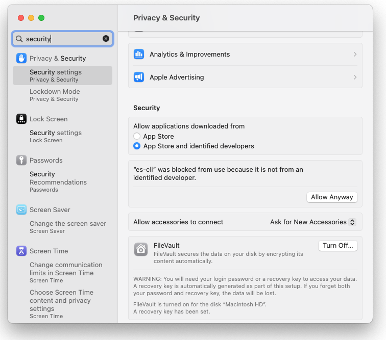
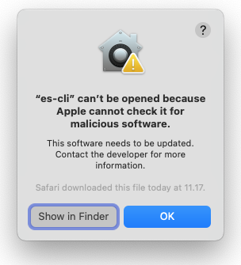

# Enterspeed Management CLI

Check out the [Enterspeed documention](https://docs.enterspeed.com/tooling/cli/overview) for help and guides on how to use the CLI. 

Make sure to [contact](https://www.enterspeed.com/contact) us if you need any help. We're happy assist!

## Installation

Download binaries from [releases](https://github.com/enterspeedhq/enterspeed-cli/releases), and include location of es-cli in your PATH.

## Run on macOS
To run the preview of the Enterspeed CLI on macOS you have to do the following:
- Sign the binary: 
```bash
sudo codesign -f -s - --deep ~/bin/es-cli
```
- Try to run the binary. You will then prompted that the binary can't be opened
- Go to System Settings > Privacy and Security
- Click "Allow Anyway" under the Security section




## Usage

```bash
$ es-cli [ group ] [ command ] {parameters}
```

### Get Started


The CLI supports both OAuth and API key authentication.

#### OAuth authentication:

```bash
$ es-cli login
```

This will open a webbrowser, with a login page, where you can signin using your Enterspeed credentials. Once signed in you can close the browser window.

If you have access to more than one tenant, use `es-cli tenant set` to switch active tenant. You can use `es-cli tenant list` to get a list of avalible tenants.


#### API key  authentication:

First you must generate a Management Client in the [Enterspeed dashboard](https://app.enterspeed.com/). Go to the _Settings_ tab and select _Management clients_, here you can create a new Management client, which will provide you with an API key. The API Key is only valid for the tenant on which it is created.


To use the API key, add the parameter `--apiKey <APIKey>` to your commands.

```bash
$ es-cli [ group ] [ command ] --apiKey <APIKey>

```

> NOTE: While in preview, your user might not have access to the  _Management clients_ tab, if you wish to try out this feature, please contact the Enterspeed team.


### CLI commands


[Global commands](docs/global-commands.md)

[Tenants](docs/tenant-commands.md)

[Environments](docs/environment-commands.md)

[Domains](docs/domain-commands.md)

[Environment clients](docs/environment-client-commands.md)

[Sources groups](docs/source-group-commands.md)

[Sources](docs/source-commands.md)

[Schemas](docs/schema-commands.md)

[Deploy](docs/deploy-commands.md)

[Source entities](docs/source-entities-commands.md)

[Views](docs/views-commands.md)


#### Logging

The CLI logs everything to the file `<UserHome>\.enterspeed\cli.log.json`.

To enable verbose logging in the console, use the `--verbose` global parameter.


#### Exit codes

For scripting purposes, we output certain exit codes for differing scenarios.

|Exit Code   |Scenario   |
|---|---|
|0  |Command ran successfully.   |
|1   |Generic error; server returned bad status code, CLI validation failed, etc.   |


#### Troubleshooting

In case of problems, please refere to the log file `<UserHome>\.enterspeed\cli.log.json` or use the ´--verbose´ parameter to diagnose the problem.

If the problem persists, try deleting the CLI state file `<UserHome>\.enterspeed\cli.state.json`, this will require you to re-run `es-cli login` if using OAuth authentication.